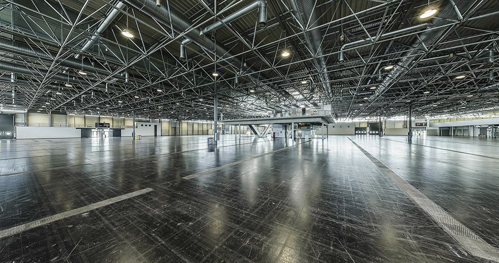
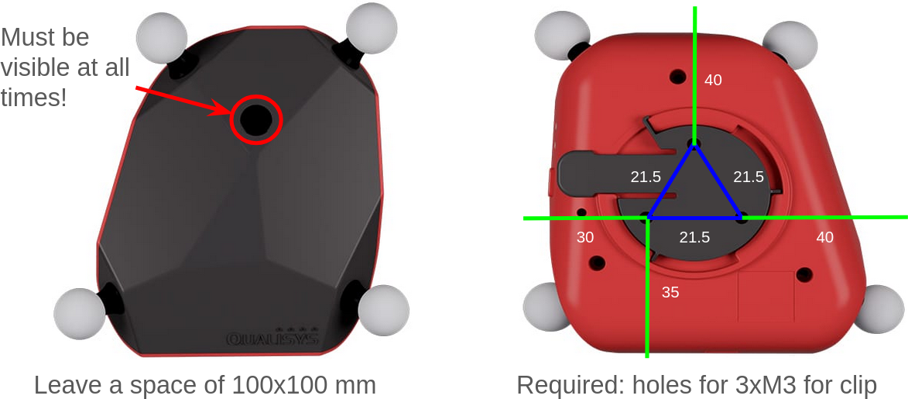
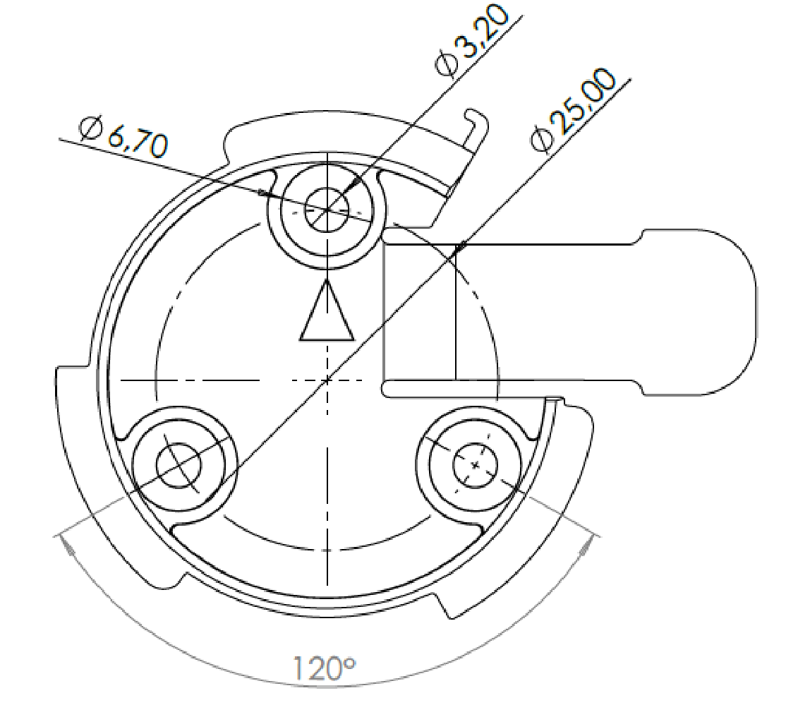
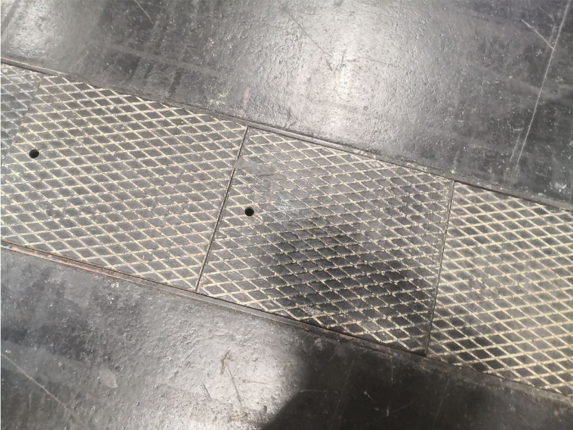
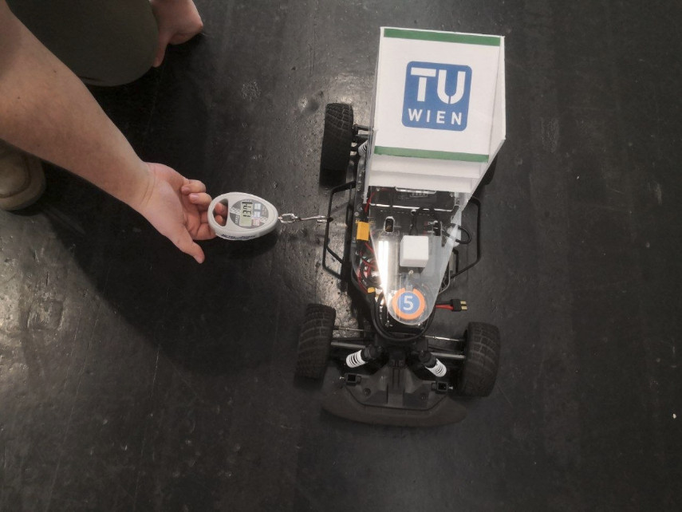
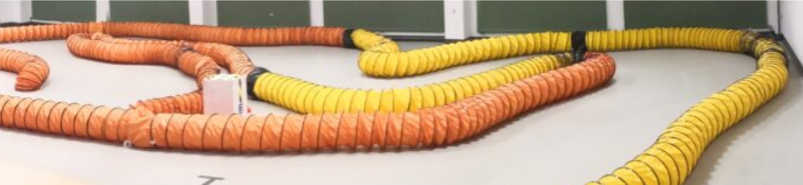
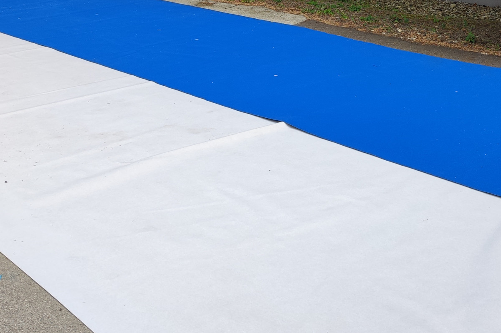
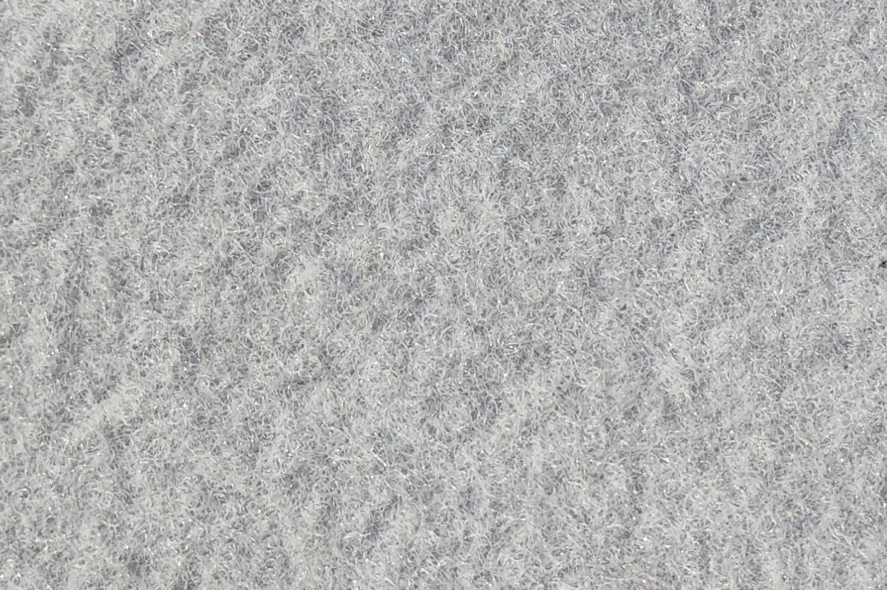
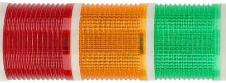

These competition rules are prepared for _27th RoboRacer Autonomous Racing Competition_. These are valid for this event only and extend the [General Rules]().

# Venue

The competition will take place in [VIECON](https://vieconcenter.at/) (Vienna Congress & Convention Center), Messeplatz 1, 1020 Wien, Austria. It will be a part of [2026 IEEE International Conference on Robotics and Automation (ICRA)](https://2026.ieee-icra.org/).

The hall can be virtually inspected [here](https://vieconcenter.at/en/hall-b).

# Vehicle Specifications

- Additional requirements:
  - Space for sticker: 40×15 mm (on a visible location; e.g., front or top of the car).
  - Space for an active marker: 70×85 mm (21 mm height<s>; mounting information will follow soon</s>).
    - Exact position on the car is not defined. As a part of the Inspection, we will measure the relative position of Traqr on your car and consider it during tracking.
    - The Traqr MUST NOT be covered from above, i.e., there MUST NOT be anything on top of it. We expect that obstruction from one side (caused by the "box") won't influence tracking quality.
    - The Traqr mount (last image) will be attached to your car using three M3 screws from above.

# Track details

- _Nature of the surface (flatness, reflectiveness, material):_
  - Painted/sealed concrete (industrial floor) with high reflection. Occasionally accompanied with metal covers (protecting the utility networks).
  - Side pulling force (peak) ≤ 20 N (for a Traxxas Fiesta with average-used stock tyres and a total weight of 3.8 kg).

- _Nature of the room (e.g., walls/windows, ceiling type):_
  - Rather darker room with no walls/windows in the close vicinity of the track. Ceiling is not flat, exposing the full building structure. Room lightning is mostly artificial.
  
- _Type of delimiters (e.g., air ducts, cardboard boxes):_
  - Yellow pipes with black stripes.
  - Orange pipes with black stripes.
  - <s>Pipes of other colors (to be confirmed).</s>
  - Cardboard boxes.
  - Wooden boards<s> (to be confirmed)</s>.
  - <i>Note: Surface of both the cardboard boxes and the wooden boards may be of any color and may contain logos. However none of them will be solid black.</i>

- _Height of delimiters:_
  - At least 30 cm.

- _Maximum size (e.g., area) of the track:_
  - 20×20 m (40×20 m for Master Cup).

- _Minimum track width (minimum distance between the inner and outer border):_

  - 1 m (however we aim to have at least 1.5 m in most of the track sections).

- _List of used track features:_

  - Open walls.
    - Both left and/or right borders.

  - Surface changes.
    - Done with covering the floor with different materials.
    - Maximum height change is 7 mm (but probably will be lower).
    - We aim to use following carpets during the competition (colors may vary):

  - Track splits.
    - Minimum track width during a track split is 1 m.

  - 
Slopes / Bridge (for Master Cup only).

    - Maximum elevation is 15 %. (However, we aim for a lower number.) <!-- clearance ~2cm,~1.4cm -->
    - Technical drawing for the Bridge used during the competition is available [here](bridge/bridge_side_profile_V3.pdf). All measurements are ideal according to our manufacturing plan, but there will be small deviations. Note that the bridge will delimited by side barriers on both sides; in the technical drawing they are omitted to improve the readability of the dimensions.
      - To check whether your car does not touch the ground on the slopes, you can use [Python script](bridge/bridge_check.py) submitted by Samir Shehadeh (LAMARRacing). Competition organizers are not responsible for correctness of the code and/or provided results.
      - Note that the visibility of bridge and its delimiters depends on the height of the LiDAR on the car. For example, LiDAR at 20 cm height can be expected to see only ~1.2 m of walls ahead in certain parts of the bridge (e.g., at the end of the flat top part before going down). To estimate it in your case, you can use following formula:

# Registration

Registration for the competition is split into two parts:

1. Competition registration, i.e., register a team with us to be able to compete.
2. Conference registration, i.e., register each team member to gain access to the competition area.

## Competition registration

Competition registration is done using a registration form available on the competition website. The limit of the <s>registered</s>approved teams is **40**. We provide up to 4 chairs, 1 table and 1 power socket for every team. In case more teams register, the time of finalizing the registration is decisive.

The registration is considered final (i.e., the team becomes approved) when the teams submit the form with:

- <s>Fill out the form</s>All required team data.
- <s>Submit a</s>A link to a video of their car driving autonomously (~1 minute).
- <s>Submit a</s>A hardware list that will be made public after the competition.

Note that the approved teams will be able to update their hardware list even after finalizing their registration; however, at latest by the date of the registration deadline.
In case that we will find unapproved hardware (e.g., sensors out of the allowed specification) we will inform the team and give them an opportunity to change the hardware.

## Conference registration

_Note: This whole section was updated._

In order to get access to the competition area, every team member must register and pay the registration fee on the ICRA website.

- The competitions-only registration rate is **275€** per person. This fee is available only with a given "discount code", available to all teams during the Competition registration.
  - The access is the same as exhibition-only fee, therefore, you will have access to:
    - Hall B, where the competitions and exhibitions are located.
    - Hall C, where the posters of accepted papers are.
    - Lunches, from Tuesday to Thursday.
    - Coffee breaks.
    - InfoVaya system, where the whole program of the conference is available.
    - Accepted papers.
- Deadline for the registration (imposed by the conference organizers) is **May 25, 2026**.
- Visa letters are available as an option during the conference registration process. They will be sent to the corresponding e-mail addresses after completing the payment.
- Other types of registration (e.g., paper author) usually contain the access to the competition area. No other registration is therefore necessary.
- Any questions, regarding the registration or visa letter, can be addressed to [icra2026registration@aimgroup.eu](mailto:icra2026registration@aimgroup.eu).

# Session

- Timetables of the sessions will become available on the first day of the competition.
- _List of used notification systems:_
  - Colored flags.
    - One set per <s>currently racing team</s>track.
  - Whistles.

# Practice

Practice track will contain all track features used in the Classic Cup of the competition. Additional track features, present only in Master Cup, will be present only in the Practice(s) after Classic Cup concludes.

- _List of Practice variants:_
  - Shared Practice.
  - Open Practice.
  - Closed Practice.
  - Mapping Practice.<s> (Most likely for Master Cup only.)</s>
- Practice track will have the same layout as the track used during the Classic Cup.

# Inspection

Car inspection will be done during the <s>first two days</s>second day of the competition. Generally, we will confirm that your car matches the submitted hardware list.

- You may take a part in the Practice sessions without Inspection.

# Qualification

Qualification won't be organized as a separate session. The teams will qualify for Head-to-Head races in two parts:

- Obstacle avoidance and kill-switch capability will be tested during a specific session.
  - Demonstrating ability to avoid both static and dynamic obstacles.
  - The car MUST avoid touching and crashing into anything.
  - Multiple attempts are possible (up to the time allocated for the testing).
  - Failing the obstacle avoidance test means that the team can attend only Time Trial, but not Head-to-Head.
    - An extra attempt MAY be allowed during one of the Time Trial heats. Obstacle Avoidance testing will use the time of the allocated heat.
    - Passing the test during this extra attempt makes the team eligible for Head-to-Head.

- Completing at least one full lap during Time Trials.

# Race organization

- _List of possible ways to start a race:_
  - Manual
  - <s>Automatic (with a [T2V module]())</s>
  - <s>Mixed</s>
- All start variants will contain three signals: `Ready`, `Set`, `Go`
  - The time delays between the signals may vary for every start.

<i>Due to an interference between the Qualisys system and T2V modules, the automatic start won't be used this time.</i>

## Manual start

- Manual start will be controlled using a set of starting lights:

    

- The signals will be as follows (subject to changes):
  - `Ready`: Red light on
  - `Set`: Orange light on
  - `Go`: Green light on
  - `Abort`: Red/Orange light flashes

- The starting lights are meant for the team to start the autonomous mode of its car manually; it is not expected that the car will be monitoring the starting lights itself.

# Time Trial

- _Number of heats, time per heat:_
  - 2 heats, ≤ 5 minutes each. Announced on the first day of the competition.

# Head-to-Head

- _Initial placement of the starting cars:_
  - Staggered grid
- _Tournament type:_
  - Double Elimination
- _Competition model:_
  - Double Cup (Classic Cup + Master Cup)
    - Seeded with the results of the Time Trial.
    - The Master Cup is racing after Classic Cup concludes.
  
- _Evaluation:_
  - Number of laps will be cup-based and announced on the first day of the competition.

# Award ceremony

The Award ceremony will be a part of a social event on Thursday evening. Note that there might be space restrictions.

- Thursday, 19:30−23:00
- TU Wien Main Building, Karlsplatz 13, Vienna
- Space restrictions: up to 6 people / team
  - Paid by the organizers.
  - Only fully registered team members are eligible. This number may be increased eventually.

# Workshop

The workshop will be on Friday, in a separate location (i.e., not in the competition area).

- Friday, 10:00−15:00
- Fakultät für Technische Chemie, TU Wien, Getreidemarkt 9, Vienna

# Additional notes

## Qualisys Motion Capture

All vehicles will be tracked using an active marker (Traqr) monitored by Qualisys Motion Capture System.

- Access to the MoCap data is provided on a best-effort basis, so the service might be unavailable or laps might not be properly recorded.
    - There are no restrictions on the use of the Motion Capture data.
    - Please also note that data might not be available when the car is under the bridge.
- During the competition, access is restricted to your own team's data.
  - First access to the data will be granted on Monday, after the track closes.
  - On the subsequent days, the lap data will be available with a 15-minute delay after you finish the lap.
- After the competition, the data will be made available as an open-access dataset.
- Example of the data shared during the competition:
    - [csv file format]()
    - [mcap file format]()