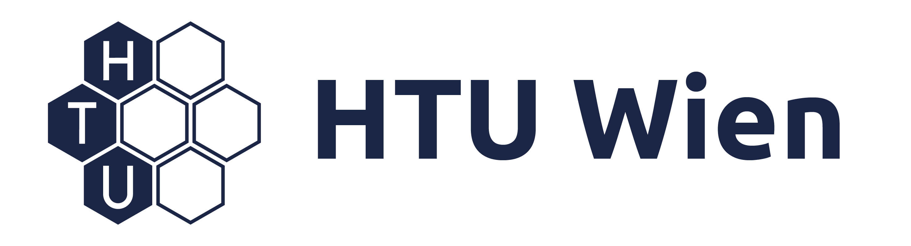
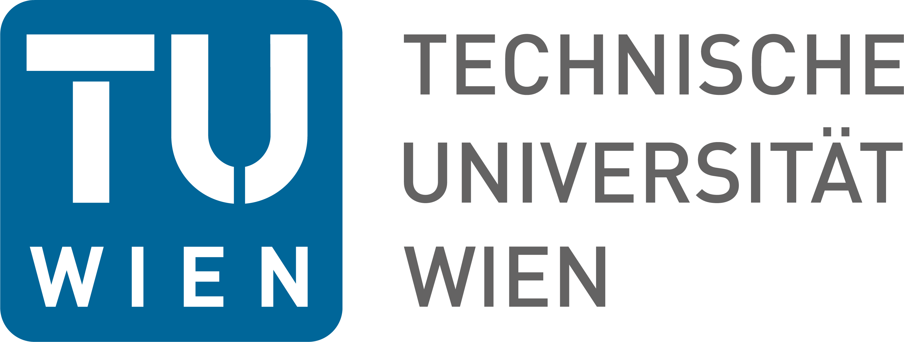
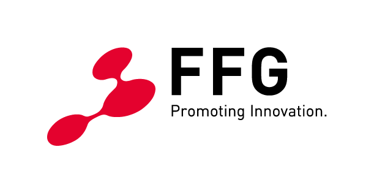
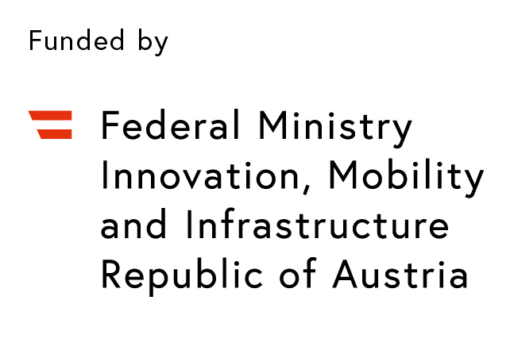
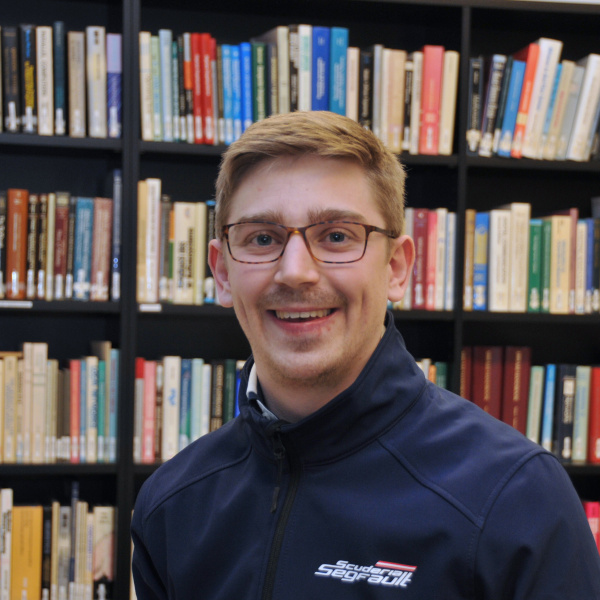

<!-- Featured Post -->
<article class="post featured">
    <header class="major">
        <h2>
            <a>{{ site.RACE_NUMBER }} Roboracer AUTONOMOUS Racing Competition</a>
        </h2>
        <left>
            

                Roboracer Autonomous Racing is a semi-regular competition organized by an international
                community of researchers, engineers, and autonomous systems enthusiasts.
                The teams participating in {{ site.RACE_NUMBER }} Roboracer Racing Competition
                at {{ site.CONF_WITH_YEAR }} will build a 1:10 scaled autonomous race car according
                to a given specification and write software for it to fulfill the objectives
                for the competition: Don't crash and minimize laptime.
            

        </left>

        

            
        

        <left>
            

                ICRA 2026 will host an in-person competition in the form of the {{ site.RACE_NUMBER }}
                Roboracer Autonomous Racing Competition as well as a virtual benchmark competition
                in the form of the Roboracer Sim Racing League.
                The main focus of the {{ site.RACE_NUMBER }} Roboracer Autonomous Racing Competition is
                an in-person competition with physical cars.
                Each team will bring their own Roboracer car and write the software for their car.
                The teams have access to a detailed build manual and can use open-source software
                that helps them get started with the car.
                The organizers provide the race setup (rules, submissions, guidelines), the track,
                and related infrastructure and organize the race itself.
                For the competition, teams first take part in a qualification session in order to
                determine seeding.
                In the qualification session, teams compete in a time trial where they need to
                demonstrate that they are able to finish laps without colliding with the track
                bounds at run time.
                Afterwards, teams compete in a knockout phase in head-to-head racing in an intense
                battle with their autonomous driving algorithms.
                Since vehicles and hardware are standardized, teams must develop robust perception,
                planning, and control algorithms that can deal with the uncertainties of a new track
                and new competitors.
                The Racing Competition phase pits competitors against each other on the same track.
            

            <!-- SIM_RACING_PARAGRAPH -->

                The Roboracer Sim Racing League is a virtual benchmark competition where teams can
                participate remotely.
                The teams will be provided with a simulator environment and a standardized car model.
                The teams will have to write software for their car to fulfill the objectives for
                the competition: Don't crash and minimize laptime.
                The teams will submit their software to the organizers, who will run the software
                on the simulator and evaluate the performance of the software.
                The teams will be ranked based on their performance in the simulator.
                The Sim Racing League is a great opportunity for teams to participate in the competition
                without the need to build a physical car and travel to the competition.
                For more information on the Roboracer Sim Racing League, please visit the
                <a href="https://autodrive-ecosystem.github.io/competitions/roboracer-sim-racing-icra-2026/">
                    5th Sim Racing League website
                </a>.
            
<!-- /SIM_RACING_PARAGRAPH -->
        </left>
    </header>

    

        
    

</article>

<section class="post">
    <h2>Sponsors:</h2>

    

        
    

    

        
        
        
        
        
    

</section>

<section class="post">
    <h2>Organizers:</h2>

    

        <strong>
            For all questions to the organizers regarding the competition, please only write to <a href="mailto:{{ site.NAV_EMAIL_LINK }}">{{ site.NAV_EMAIL_LINK }}</a> and do not contact individual people by their personal email address! Thank you!
        </strong>
    

    

        

            

            

            

            

        

    

    

        

            

                <b><a href="https://www.seas.upenn.edu/~rahulm/">Rahul Mangharam</a></b>
                <h6>Associate Professor</h6>
                <h6>Department of Electrical and Systems Engineering</h6>
                <h6>University of Pennsylvania</h6>
            

            

                <b><a href="https://www.clemson.edu/cecas/departments/automotive-engineering/people/Venkat%20Krovi.html">Venkat Krovi</a></b>
                <h6>Michelin Chair Professor</h6>
                <h6>Department of Automotive Engineering</h6>
                <h6>Clemson University</h6>
            

            

                <b><a href="https://tiss.tuwien.ac.at/person/248818.html">Radu Grosu</a></b>
                <h6>Full Professor and Head of Research Unit</h6>
                <h6>Research Unit of Cyber-Physical Systems</h6>
                <h6>TU Wien (Vienna University of Technology)</h6>
            

            

                <b><a href="https://tiss.tuwien.ac.at/person/251490.html">Ezio Bartocci</a></b>
                <h6>Full Professor</h6>
                <h6>Research Unit of Cyber-Physical Systems</h6>
                <h6>TU Wien (Vienna University of Technology)</h6>
            

        

    

    

        

            

            

            

            

        

    

    

        

            

                <b><a href="mailto:johannes.betz@tum.de">Johannes Betz</a></b>
                <h6>Assistant Professor</h6>
                <h6>Department of Mobility Systems Engineering</h6>
                <h6>Technical University of Munich</h6>
            

            

                <b><a href="https://tiss.tuwien.ac.at/person/184573.html">Andreas Brandstätter</a></b>
                <h6>Senior Scientist</h6>
                <h6>Research Unit of Cyber-Physical Systems</h6>
                <h6>TU Wien (Vienna University of Technology)</h6>
            

            

                <b><a href="https://ahmadamine998.github.io/">Ahmad Amine</a></b>
                <h6>Ph.D. Candidate</h6>
                <h6>Department of Electrical and Systems Engineering</h6>
                <h6>University of Pennsylvania</h6>
            

            

                <b><a href="https://tiss.tuwien.ac.at/person/309967.html">Felix Resch</a></b>
                <h6>Project assistant</h6>
                <h6>Research Unit of Cyber-Physical Systems</h6>
                <h6>TU Wien (Vienna University of Technology)</h6>
            

        

    

    

        

            

            

            

            

        

    

    

        

            

                <b><a href="https://tiss.tuwien.ac.at/person/424855.html">Jaroslav Klapalek</a></b>
                <h6>University assistant</h6>
                <h6>Research Unit of Cyber-Physical Systems</h6>
                <h6>TU Wien (Vienna University of Technology)</h6>
            

            

                <b><a href="mailto:csamak@clemson.edu">Chinmay Samak</a></b>
                <h6>Ph.D. Candidate</h6>
                <h6>Department of Automotive Engineering</h6>
                <h6>Clemson University - ICAR</h6>
            

            

                <b><a href="mailto:tsamak@clemson.edu">Tanmay Samak</a></b>
                <h6>Ph.D. Candidate</h6>
                <h6>Department of Automotive Engineering</h6>
                <h6>Clemson University - ICAR</h6>
            

            

                <b><a href="https://tiss.tuwien.ac.at/person/311391.html">Moritz Christamentl</a></b>
                <h6>Student Staff in Research and Administration</h6>
                <h6>Research Unit of Cyber-Physical Systems</h6>
                <h6>TU Wien (Vienna University of Technology)</h6>
            

        

    

    

        

            

        

    

    

        

            

                <b><a href="https://www.mos.ed.tum.de/en/avs/team/felix-jahncke/">Felix Jahncke</a></b>
                <h6>Ph.D. Candidate</h6>
                <h6>Department of Mobility Systems Engineering</h6>
                <h6>Technical University of Munich</h6>
            

        

    

</section>