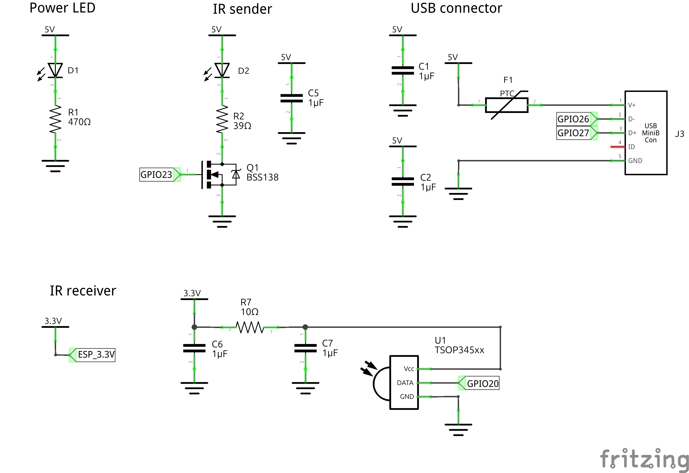

_Original blog post is available here: <https://scuderiasegfault.github.io/blog/2026/03/17/t2v-module.html>_

- ToC
{:toc}

One issue we have encountered in the many races we have participated in is the impact of human reaction time during the
starting sequence.
<!--more-->
While a difference in starting time might have been a minor annoyance a few years ago, today we have incredibly
competitive teams with lap times only separated by a few hundredths of a second. With such a minor difference in lap times,
the result of the race may come down to human reaction time, which is in the order of a few tenths of a second.

As a mitigation for this problem, we are pleased to announce the new RoboRacer Track to Vehicle Module (T2V Module),
developed in cooperation with the RoboRacer foundation for the 27th RoboRacer Grand Prix in Vienna. The T2V Module
consists of one or more transmitters located around the track, which send commands and track information to receivers
mounted on the cars using infrared signals. During the Vienna Grand Prix, we will utilize this system to start the races
and, if possible, to indicate slow-driving sections[^1].

[^1]: Subject to final rule agreement and roll-out of T2V Module.

To allow for an early roll-out to as many teams as possible, we provide build instructions and software for the
receivers, based on the ESP32-P4 platform. Teams can find those instructions on GitHub in the repository for the T2V
Module. We also provide a basic ROS integration and will include a sensible integration for our Ackermann Mux NG (our new implementation for the Ackermann Mux, which we will release soon). All instructions, source code, and designs will be available as open-source projects under MIT or CC0 licenses, respectively, after we have finalized the initial versions for each component.

# Protocol

The T2V Module uses IR NEC[^2] frames to relay information from the track to the cars. Many commercially available
infrared remotes use IR NEC frames to transmit data, and the protocol is simple enough for small microcontrollers to
interpret. One drawback of the protocol is that it is comparatively slow, with one frame requiring approximately 67.5 ms
to transmit. While this is not an issue if all cars use the T2V Module, the starting system has to take the frame
transmission time into account when human drivers are involved. The T2V protocol only uses the standard mode for IR NEC
addressing, not the extended variant.

[^2]: See [https://www.sbprojects.net/knowledge/ir/nec.php](https://www.sbprojects.net/knowledge/ir/nec.php) for more details on the IR NEC protocol.

IR NEC transmits an address and a command in each frame, both of which are utilized by the T2V Module. Systems using the T2V
Module protocol MUST use the address to process only frames destined for the system. For this purpose, we define four
blocks of addresses that require different treatment. The table below defines the different blocks of addresses.

| Start | End  | Name                          |
|-------|------|-------------------------------|
| `00`  | `0F` | Multicast                     |
| `10`  | `7F` | Race reserved                 |
| `80`  | `EF` | Open addresses                |
| `F0`  | `FE` | RFU (Reserved for future use) |
| `FF`  | `FF` | Broadcast                     |

We use **multicast** (`0x00` - `0x0F`) addresses to identify a group of receivers that MUST process a frame, such as all
cars on one track or all cars in a group (e.g. all cars from the same team, or all cars in a training slot). To address
all receivers at once, we define the **broadcast** address (`0xFF`).
Any receiver receiving a frame with this address MUST process the frame.

For organizational reasons, we split the unicast addresses into two ranges: the **race reserved** (`0x10` - `0x7F`)
range and the open (`0x80` - `0xEF`) range. During a race, the race directors assign **race reserved** addresses. No
receiver SHALL use an address in this range unless the race directors have assigned it. Receivers can use any **open**
address freely at any time, but teams SHOULD coordinate the used addresses during a race. Addresses in the range
`0xF0` - `0xFE` are **reserved for future use**.

To date, only the essential commands required for a starting system have been defined. After the Vienna Grand Prix, we
will develop a standardization process to add additional commands to the standard. A complying device needs to implement
at least the commands `START_GO`, `START_ABORT`, and `STOP`. The other commands, `START_READY` and `START_SET`, are
informative, and devices might use them to optimize their starting routine (e.g., by allowing the car's operator to press
the dead man's switch without the car starting to drive).

| ID          | Name        | Required | Usage                            |
|-------------|-------------|----------|----------------------------------|
| `00`        | START_READY | No       | Starting sequence has started.   |
| `01`        | START_SET   | No       | Start of race is imminent.       |
| `02`        | START_GO    | Yes      | Start the race.                  |
| `03`        | START_ABORT | Yes      | Start sequence has been aborted. |
| `04` - `7E` | ---         |          | RFU                              |
| `7F`        | STOP        | Yes      | The car MUST stop immediately.   |
| `80` - `FF` | ---         |          | RFU                              |

# Reference Receiver

We aim to make the T2V Module accessible to as many teams as possible by providing an affordable and widely available
Reference Receiver. To achieve this, we have based the receiver on
the [ESP32-P4-NANO](https://www.waveshare.com/esp32-p4-nano.htm) from Waveshare, which is internationally available and
costs less than 20 USD. In the minimum configuration, teams need to purchase an additional IR Receiver, a USB plug with
a corresponding cable, and a few jumper wires:

| Reference      | Note                             | Value/Type | Farnell Code | Link (Examples)                                              |
| -------------- | -------------------------------- | ---------- | ------------ | ------------------------------------------------------------ |
|                | ESP32-P4-NANO                    |            |              | [Waveshare.com](https://www.waveshare.com/esp32-p4-nano.htm?sku=29026) |
| C1, C2, C3, C6 | Capacitors                       | 1 µF       | 3188966      |                                                              |
| D1             | Power LED                        | Green      | 2099252      |                                                              |
| F1             | Fuse                             |            | 2834854      |                                                              |
| J3             | USB Connector                    | USB mini B | 4552359      | [Amazon.de](https://www.amazon.de/DAOKAI-8-Piece-USB-Adapter-2-54/dp/B09YYHNCC3/ref=sr_1_1_sspa?aref=IGryautNMT) |
| R1             | Resistor for Power LED           | 470 Ω      | 9240926      |                                                              |
| R7             | Resistor for Receiver LED filter | 10 Ω       | 9236643      |                                                              |
| U1             | Receiver LED                     | TSOP345xx  | 2251343      | [Amazon.de](https://www.amazon.de/-/en/LAOMAO-Pairs-Infrared-Emission-Receiver/dp/B00EFOTJZE/ref=sr_1_5) |
|                | Jumper wires                     |            |              |                                                              |

For local testing you can easily extend the circuit with infrared sender:

| Reference | Note                      | Value/Type | Farnell Code | Link (Examples)                                              |
| --------- | ------------------------- | ---------- | ------------ | ------------------------------------------------------------ |
| C5        | Capacitor for Sender LED  | 1 µF       | 3188966      |                                                              |
| D2        | Sender LED                | Infrared   | 1328299      | [Amazon.de](https://www.amazon.de/-/en/LAOMAO-Pairs-Infrared-Emission-Receiver/dp/B00EFOTJZE/ref=sr_1_5) |
| Q1        | Transistor for Sender LED | BSS138     | 4655271      |                                                              |
| R2        | Resistor for Sender LED   | 39 Ω       | 9236716      |                                                              |

Wiring diagram:

We also provide a PCB design that includes the USB plug, headers for the
IR receiver, and headers for some typical low-level protocols, such as I2C, SPI, and one-wire. We will release the build
instructions in a forthcoming post, followed by the PCB design once it has been finalized and tested.

The firmware handles the processing of the IR NEC frames and communication as a USB device. As we intend to expand the
receiver's functionality to read data from temperature sensors and voltage meters, these features will also be generally
available when we have finished testing them.

The Reference Receiver uses USB Full-Speed to transfer the IR NEC frames to the car. By default, it uses the vendor ID
`0x5455`, the product ID `0x1911` and a vendor-specific interface with one endpoint. The endpoint with ID 1 is
an IN Interrupt endpoint that transfers 4 bytes of data (the IR NEC frame) when a frame is received.
For details on extensions and their endpoints, please refer to the documentation on the extension-specific branches.

For configuration, the Reference Receiver uses a Bluetooth Low Energy Interface. The race directors use this interface
during races to configure the correct addressing. For this purpose, the device provides a BLE GATT service under the
UUID `c902d400-1809-2a94-904d-af5cbdcefe9b` with the required characteristics to properly configure the receiver. The
table below describes the characteristics and their BLE attributes.

| Characteristic | Name            | Attributes  | Description                                                                                      |
|----------------|-----------------|-------------|--------------------------------------------------------------------------------------------------|
| `FF01`         | Team Name       | Read-only   | The name of the team.                                                                            |
| `FF02`         | Car Name        | Read-only   | Identfier of the car.                                                                            |
| `FF03`         | IR NEC frames   | Read/Notify | On read returns the latest IR NEC frame. If used with notifications sends the most recent frame. |
| `FF04`         | Unicast address | Read/Write  | Unicast address for this device.                                                                 |
| `FF05`         | Multicast mask  | Read/Write  | Multicast mask, with each bit in the mask representing one possible address.                     |

# Reference Sender

Similar to the Reference Receiver, we have also developed a Reference Sender for use at the Vienna Grand Prix. It is based
on the same hardware platform as the receiver, but uses Power over Ethernet for power supply and network connectivity.
In the first version, it will allow direct commands via UDP and TCP, as well as communication based on Zenoh for
integration into more complex systems. Once we have finalized the protocols, we will make them available, including some
basic tools for testing.

# Specialized Sender: Starting Lights

We drew inspiration from the starting lights used in a slightly larger racing series (hint: about ten times larger) when
designing the starting lights. They feature IR senders, as well as five lamps on each side of the starting line to
indicate the starting process to humans. As mentioned before, the transmission of the IR NEC frame will
finish when the starting lights indicate the start of the race.

We propose the following sequence for the starting lights:

1. All lights start dark.
2. The first light shows red, IR NEC `START_READY` is sent.
3. Each second, another light turns red until all lights are red.
4. IR NEC `START_SET` is sent.
5. After another second, all lights turn green, IR NEC `START_GO` is sent.

If the race directors need to abort the start, the lights will flash yellow slowly, and IR NEC `START_ABORT` is sent. To
indicate a faulty start, the lights will flash red, and an IR NEC `STOP` is sent.
